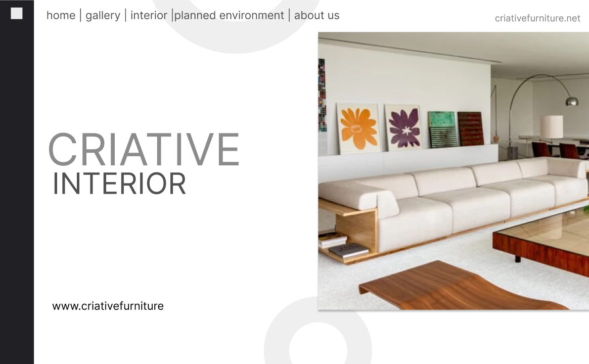

# Criative Furniture

Aplicação de modelo para aula de React - `Vem Ser ed. 13`

## Tecnologias usadas:
- React: (https://react.dev/)  
- Typescript: (https://www.typescriptlang.org/)
- Scss Modular: (https://sass-lang.com/)
- Tailwind(?): (https://tailwindcss.com/) - ainda a decidir ...
- Material UI: (https://mui.com/material-ui/getting-started/installation/);

## Comandos dr instalação:
- Aplicação criada por cra: `npx create-react-app criative furniture --template typescript`;
- Scss: `npm install sass --save-dev`
- Tailwind(?): `npm install -D tailwindcss postcss autoprefixer` -- `npx tailwindcss init -p`;
- Material UI: `npm install @mui/material @emotion/react @emotion/styled`;

## Link do Figma do projeto:
Link: (https://www.figma.com/file/EmkHbWnwBl69cfA8Vr27i5/projeto-moveis?type=design&node-id=0-1&mode=design&t=0tkedFEX7KFPUkXw-0);

